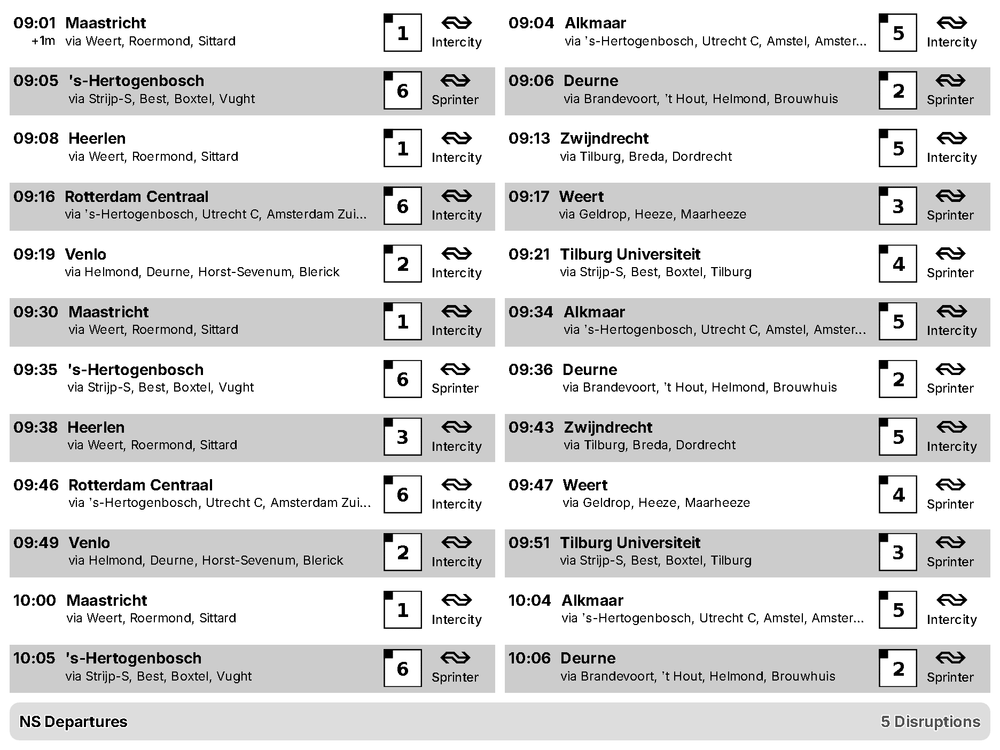

# TRMNL NS Station Plugin

A [TRMNL](https://trmnl.com/) plugin which allows you to see the coming Departures or Arrivals at a certain train station in the Netherlands.



## Development

You can run this plugin locally for development by copying `.env.example` into `.env` and filling the required environment variables. Then, run:

```
./bin/trmnlp serve
```

## Contributing

Feel free to open an issue or a pull request.

## License

[CC-BY 4.0](LICENSE) © [Henrique Dias](https://hacdias.com)
